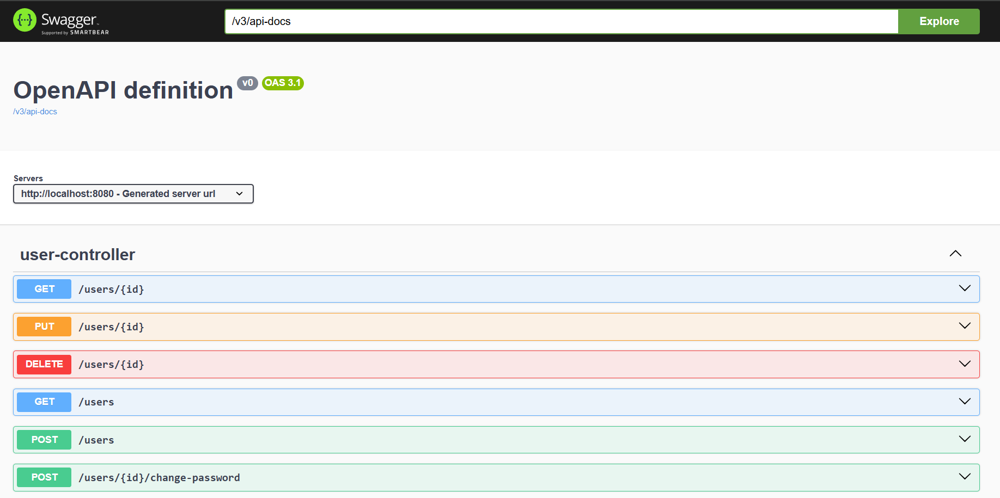
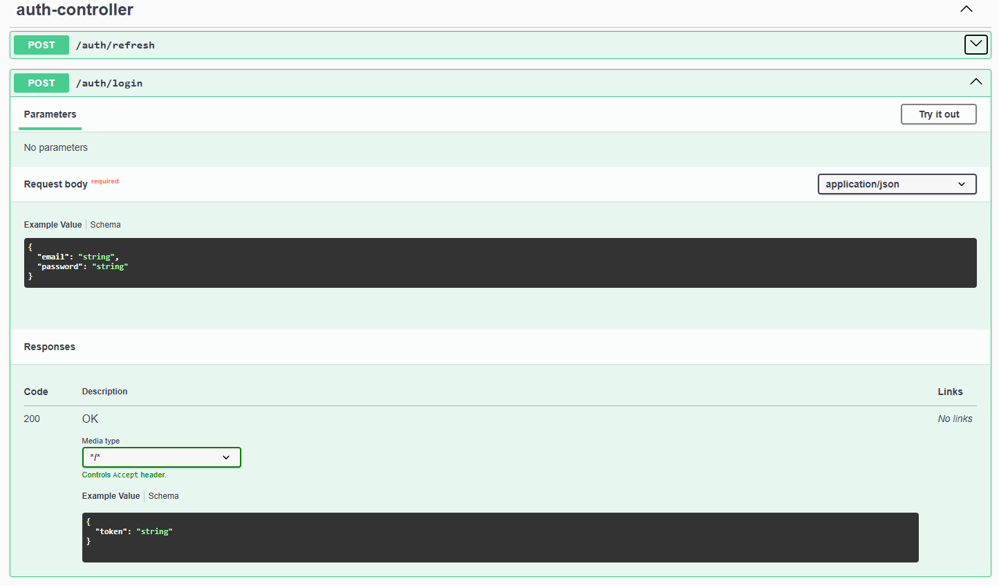
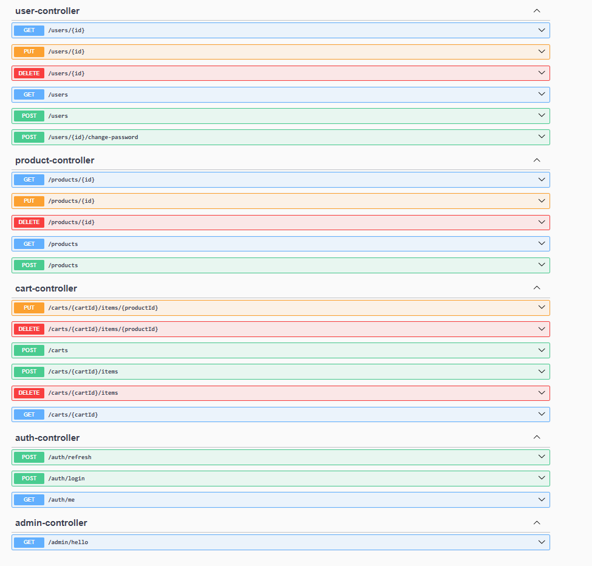
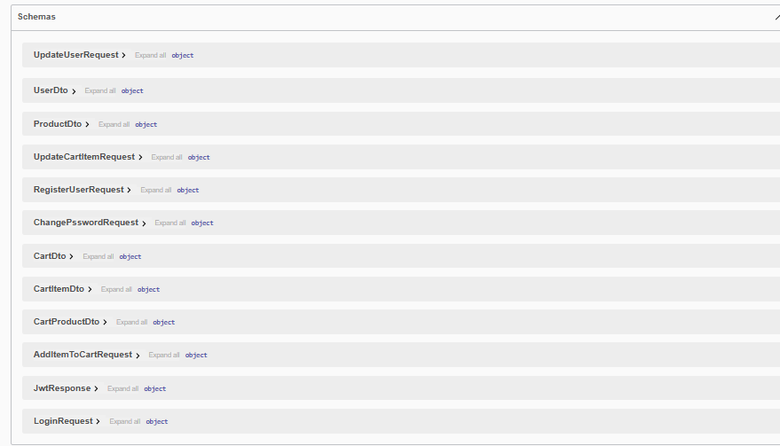

# 🛒 Store API

A **Spring Boot** e‑commerce backend with a full **JWT** auth story: **role-based access**, **short-lived access tokens**, and **refresh tokens** (HttpOnly cookie). Built for clarity, security-minded defaults, and easy local development.

---

## ✨ Features

| Area | What you get                                                                                                                        |
|------|-------------------------------------------------------------------------------------------------------------------------------------|
| 🔐 **Auth** | Login at `POST /auth/login` — returns a **JWT access token**; **refresh token** is set as an **HttpOnly** cookie (`/auth/refresh`). |
| 🔄 **Refresh** | `POST /auth/refresh` issues a new access token when the refresh cookie is valid.                                                    |
| 👤 **Current user** | `GET /auth/me` — requires a valid **Bearer** access token.                                                                          |
| 🛡️ **RBAC** | Roles: **`USER`**, **`ADMIN`**. Routes under `/admin/**` require **ADMIN**.                                                         |
| 🛍️ **Store** | Products, categories, carts, users, profiles, addresses, wishlists.                                                                 |
| ✅ **Validation** | Bean Validation on DTOs + consistent HTTP status handling.                                                                          |
| 🗄️ **Database** | **MySQL** + **Flyway** migrations: schema stays versioned and repeatable.                                                           |
| 📚 **API docs** | **Swagger UI** (springdoc-openapi) when the app is running.                                                                         |

**Token lifetimes (defaults in `application.yaml`):** access ~**15 minutes**, refresh ~**7 days** .

---

## 🧰 Tech stack

- **Java 23** · **Spring Boot 3.4** (Web, Security, Data JPA, Validation)
- **JWT** (jjwt) · **BCrypt** passwords
- **MySQL** · **Flyway**
- **Lombok** · **MapStruct**
- **springdoc-openapi** (Swagger UI)

---

## 🚀 Run locally

### Prerequisites

- **JDK 23**
- **MySQL** (e.g. 8.x) running on `localhost:3306`
- **Maven** (or use the included `mvnw` / `mvnw.cmd` wrapper)

### 1️⃣ Database

The app uses database **`store_api`** (created automatically if your MySQL user is allowed).

Set credentials via environment variables (used in `application.yaml`):

| Variable | Example |
|----------|---------|
| `DB_USERNAME` | `root` |
| `DB_PASSWORD` | your MySQL password |

### 2️⃣ JWT secret

Set a strong secret (used to sign tokens):

| Variable | Notes |
|----------|--------|
| `JWT_SECRET` | Long random string (e.g. 32+ characters). **Do not commit real secrets.** |


### 3️⃣ Start the app

From the project root:

**Windows — CMD**

```bat
set DB_USERNAME=root
set DB_PASSWORD=your_password
set JWT_SECRET=your-very-long-random-secret-key-here
mvnw.cmd spring-boot:run
```

**macOS / Linux**

```bash
export DB_USERNAME=root
export DB_PASSWORD=your_password
export JWT_SECRET=your-very-long-random-secret-key-here
./mvnw spring-boot:run
```

Or set the same variables in your IDE run configuration.

### 4️⃣ Try it

1. **Register** — `POST /users` (public).
2. **Login** — `POST /auth/login` with email/password → response body contains the **access token**; browser clients receive the **refresh** cookie on `Set-Cookie`.
3. **Call protected APIs** — header: `Authorization: Bearer <access_token>`.
4. **Swagger UI** — [http://localhost:8080/swagger-ui/index.html](http://localhost:8080/swagger-ui/index.html) (default port **8080** unless you changed it).

> **Note:** The refresh token cookie is marked **`Secure`**. On **plain HTTP** localhost, some browsers may not send it. For full refresh flow locally, use **HTTPS** or adjust cookie settings for dev if needed.

---

## 📁 Project layout 

- `Controllers` — REST endpoints (`/auth`, `/products`, `/carts`, …)
- `config` — Security, JWT configuration
- `filters` — JWT filter for Bearer tokens
- `services` — Business logic (e.g. `JwtService`)
- `resources/db/migration` — Flyway SQL


---

## 📸 Screenshots

<p align="center">
  
  
</p>

<p align="center">
  
  
</p>

---

<p align="center">
  Made with ☕ and <strong>Spring Boot</strong>
</p>